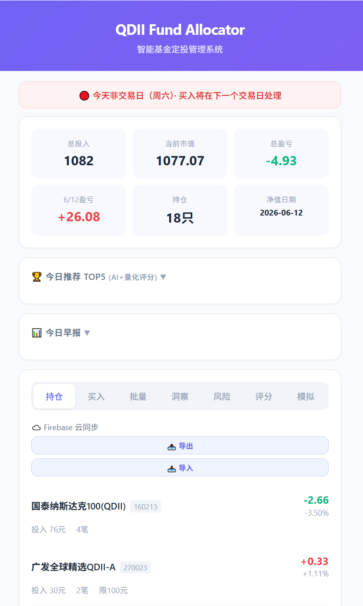
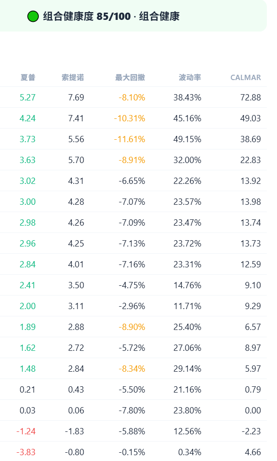
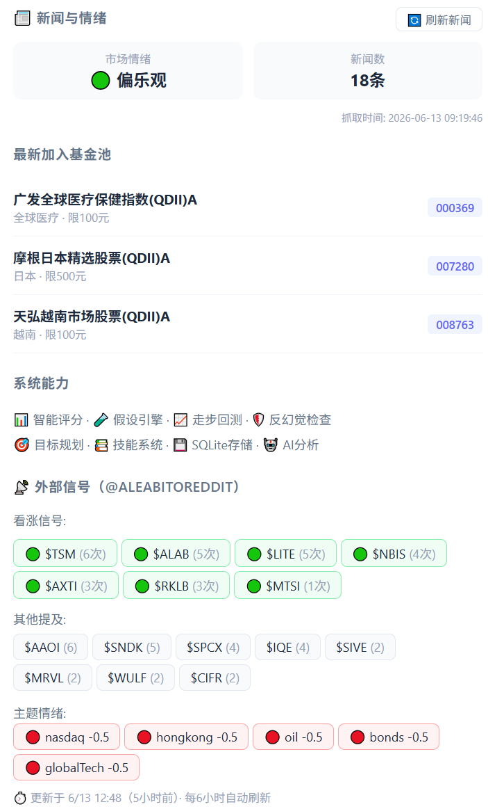

<div align="center">

# 🛩️ QDII Pilot

### AI 驱动的 QDII 基金智能投资系统

**每天自动告诉你：今天该买哪只基金、各买多少、为什么这么买。**

[](https://github.com/zeng111234/qdii-allocator/stargazers)
[](https://github.com/zeng111234/qdii-allocator/blob/main/LICENSE)
[](https://github.com/zeng111234/qdii-allocator/actions)
[](https://nodejs.org/)

<br/>

📸 **[在线 Demo](https://zeng111234.github.io/qdii-allocator/)** · 🚀 **[快速开始](#-快速开始)** · 📊 **[功能详解](#-核心功能)** · 💬 **[AI 助手](#-ai-投资助手)**

</div>

---

## 🤔 为什么做这个？

买 QDII 基金的人都知道这些痛点：

| 痛点                           | QDII Pilot 的解法                                      |
| ------------------------------ | ------------------------------------------------------ |
| 每天限购 100~1000 元，额度稀缺 | 🧠 智能评估每只基金的稀缺度，优先买最值得的            |
| 10+ 只基金，预算怎么分？       | 📊 一键算出最优分配方案                                |
| 什么时候买？买多少？           | 🤖 综合净值走势 + Twitter 情绪 + AI 判断，每天自动推荐 |
| 手动记账太麻烦                 | 💰 自动追踪持仓、计算盈亏、评估组合风险                |
| 忘了看限购变化                 | ⚡ 自动监控申购状态，暂停/恢复第一时间提醒             |

**不用盯盘，不用算，打开邮箱就有答案。**

---

## 📸 截图

<table>
  <tr>
    <td align="center"><b>投资仪表盘</b></td>
    <td align="center"><b>25维评分系统</b></td>
    <td align="center"><b>AI 投资助手</b></td>
  </tr>
  <tr>
    <td></td>
    <td></td>
    <td></td>
  </tr>
</table>

---

## ✨ 核心功能

### 📊 评分与推荐

| 功能                 | 说明                                                                                            |
| -------------------- | ----------------------------------------------------------------------------------------------- |
| 🧠 **25 维因子评分** | 动量(8)、波动率(2)、趋势(3)、回撤(3)、质量(3)、QDII特色(2)、情绪(2)、分散度(1)，归一化 0-100 分 |
| 📈 **今日推荐**      | 基于客户端因子引擎实时计算，与评分 Tab 排名 100% 一致                                           |
| 🔬 **假设追踪**      | 每次推荐自动创建投资假设，追踪 3/7/14/30 日收益，统计胜率                                       |
| 📊 **回测验证**      | 历史回测 + 走步回测（滚动窗口验证，防止策略过拟合）                                             |

### 💰 持仓管理

| 功能            | 说明                                                     |
| --------------- | -------------------------------------------------------- |
| 💰 **持仓追踪** | 记录每笔买入，自动计算盈亏、成本、当前市值，支持多次买入 |
| 🗑️ **买入删除** | 每笔买入记录可单独删除，误操作可撤回                     |
| ✅ **自动结算** | 待确认买入自动回填净值和份额（T+2 交易日）               |
| ☁️ **云同步**   | Firebase 多设备持仓自动同步，手机/电脑数据实时一致       |

### 🤖 AI 能力

| 功能                  | 说明                                                                                               |
| --------------------- | -------------------------------------------------------------------------------------------------- |
| 💬 **AI 投资助手**    | 20 年投资专家角色，理解基金底层持仓（纳指→英伟达/苹果/微软），结合全量评分+新闻+信号给出个性化建议 |
| 🤖 **AI 早报**        | Mimo 模型每日生成口语化投资早报，含市场情绪+持仓点评+操作建议                                      |
| 🐂🐻 **多智能体辩论** | Bull/Bear 辩论 + 共识/分歧点 + 三方风险评估（激进/保守/中立）                                      |
| 🌐 **外部信号**       | 抓取 X/Twitter 大V 观点，分析看涨/看跌情绪                                                         |
| 📰 **全球新闻**       | 5 个栏目（环球/美股/港股/期货/基金），36 条新闻 + 情绪分析                                         |

### 🎨 页面体验

| 功能            | 说明                                                  |
| --------------- | ----------------------------------------------------- |
| 🌙 **暗色主题** | 自动跟随系统主题，CSS 变量体系，卡片 hover 效果       |
| 📱 **响应式**   | 手机/平板/电脑自适应布局                              |
| 📧 **邮件推送** | 每天自动发投资计划到邮箱，含排名、持仓、风控、AI 报告 |
| ⚡ **零服务器** | GitHub Actions 每天定时自动运行，不用自己运维         |

---

## 🚀 快速开始

### 1. 克隆 & 安装

```bash
git clone https://github.com/zeng111234/qdii-allocator.git
cd qdii-allocator
npm install
```

### 2. 配置

```bash
cp .env.example .env
```

编辑 `.env`：

| 配置项         | 说明                            | 必填 |
| -------------- | ------------------------------- | ---- |
| `SMTP_HOST`    | SMTP 服务器                     | ✅   |
| `SMTP_USER`    | 发件邮箱                        | ✅   |
| `SMTP_PASS`    | SMTP 授权码                     | ✅   |
| `MAIL_TO`      | 收件邮箱                        | ✅   |
| `LLM_API_KEY`  | AI API 密钥（Mimo/Siliconflow） | 可选 |
| `LLM_BASE_URL` | AI 接口地址                     | 可选 |
| `LLM_MODEL`    | 模型名（如 `mimo-v2.5-pro`）    | 可选 |
| `FIREBASE_URL` | Firebase Realtime DB URL        | 可选 |
| `FIREBASE_KEY` | Firebase 密钥                   | 可选 |

### 3. 试运行

```bash
# 不发邮件，只看推荐结果
node index.js --dry-run

# 指定预算和策略
node index.js --dry-run --budget 30 --strategy dynamic
```

### 4. 部署到 GitHub Actions（零成本自动化）

1. 推送代码到 GitHub
2. 进入仓库 `Settings > Secrets and variables > Actions`
3. 添加上面表格中的 Secrets
4. 每天自动运行 🎉

---

## 📖 使用指南

### 每日推荐

```bash
# 查看今日推荐
node index.js --today

# 查看推荐 + 快捷买入指令
node index.js --today --quick
```

### 持仓管理

```bash
# 查看当前持仓
node index.js --portfolio

# 记录买入
node index.js --buy 270042 10
node index.js --buy 270042 10 2025-05-28           # 指定日期
node index.js --buy 270042 10 8.5243 2025-05-28    # 指定净值和日期

# 批量导入
node index.js --import-file data/buys.txt
```

### 回测 & 优化

```bash
# 策略回测
node index.js --backtest --backtest-days 120

# 走步回测（推荐，防过拟合）
node index.js --walk-forward

# 自动优化评分权重
node index.js --optimize-weights
```

### 假设追踪

```bash
# 查看投资假设报告
node index.js --hypotheses
```

### Web 界面

```bash
# 启动 Web 界面
node index.js --web

# 手机访问：http://你的IP:3000/quick
```

---

## 💬 AI 投资助手

页面内置了 AI 投资助手，基于 **Mimo 模型**（小米）驱动，不需要额外配置 API Key。

### 专家级能力

- **底层持仓分析**：知道纳指基金里有英伟达/苹果/微软，港股基金里有腾讯/阿里
- **相关性识别**：发现你持有 7-8 只纳指基金底层高度重叠，建议补充其他类型
- **新闻解读**：结合当日新闻和外部信号，判断行业/个股风险和机会
- **风格识别**：成长型 vs 价值型 vs 指数型 vs 主题型

### 快捷问题

- 🎯 **今天该买什么？** — 结合评分、趋势、限购、持仓集中度给出个性化建议
- 🛡️ **组合风险分析** — 分析持仓集中度和相关性
- 📰 **市场情绪判断** — 综合新闻和外部信号
- 📊 **加减仓建议** — 基于盈亏和趋势

### 喂入的数据

AI 助手能看到你页面上的所有数据：

- 全量 32 只基金评分（与评分 Tab 一致）
- 持仓盈亏和市值
- 12 条新闻 + 情绪评分
- 15 条 Twitter/Reddit 外部信号
- 今日 AI 早报
- 限购稀缺度

---

## 🌐 部署方式

### 方式一：GitHub Pages（推荐，零成本）

项目内置了 GitHub Pages 构建脚本，每天自动更新数据：

1. 进入仓库 `Settings > Pages`
2. Source 选择 `Deploy from a branch`，分支选 `main`，目录选 `/docs`
3. 保存后，访问 `https://你的用户名.github.io/qdii-allocator/`

**自动更新**：GitHub Actions 每天运行后会自动构建并推送数据到 `docs/`，你的在线 Demo 永远是最新状态。

**密码保护**：页面默认需要输入密码才能查看，密码在 `docs/index.html.template` 中配置。

### 方式二：本地 Web 界面

```bash
# 启动 Web 管理界面（电脑访问）
node index.js --web

# 或双击启动
web.bat
```

浏览器打开 `http://localhost:3000`，手机同 WiFi 访问 `http://你的IP:3000`

### 方式三：手机快捷买入

```bash
# 手机浏览器访问
http://你的IP:3000/quick
```

专为手机设计的页面：

- 顶部：持仓概览（总投入/市值/盈亏）
- 中部：快捷按钮（已持有的基金一键买入）
- 底部：输入框，输入 `270042 10` 即可买入

> 💡 **推荐**：GitHub Pages 作为公开看板，本地 Web 界面用来管理持仓和录入买入。

---

## ☁️ Firebase 云同步

支持多设备持仓数据自动同步：

1. 在 [Firebase Console](https://console.firebase.google.com/) 创建项目和 Realtime Database
2. 在 `.env` 中配置 `FIREBASE_URL` 和 `FIREBASE_KEY`
3. 页面持仓 Tab 顶部显示 **⬆️ 上传** / **⬇️ 下载** 按钮

**同步机制**：

- 页面加载时自动从 Firebase 下载最新数据
- 每次买入后自动上传到 Firebase
- 手动点击 **⬆️ 上传** / **⬇️ 下载** 强制同步

---

## 🏗️ 技术架构

```
qdii-allocator/
├── index.js                    # CLI 主入口
├── lib/
│   ├── allocator.js            # 基础分配算法
│   ├── dynamic-strategy.js     # 智能动态策略（核心）
│   ├── scorer.js               # 服务端评分引擎（17权重因子）
│   ├── daily-brief.js          # AI 早报生成（Mimo 模型）
│   ├── multi-agent-debate.js   # 多智能体辩论模块
│   ├── ai-analyst.js           # LLM 分析模块
│   ├── hypothesis-engine.js    # 假设追踪引擎
│   ├── walk-forward.js         # 走步回测验证
│   ├── portfolio.js            # 持仓追踪 + 自动结算
│   ├── risk.js                 # 组合风控
│   ├── external-signals.js     # Twitter 信号抓取
│   ├── fund-data.js            # 基金数据 + 指标计算
│   └── web-server.js           # Web 管理界面
├── scripts/
│   ├── update-nav-cache.js     # 净值缓存更新脚本
│   ├── update-external-signals.js # 外部信号更新脚本
│   ├── update-purchase-limits.js  # 限购额度更新脚本
│   └── fix-hypotheses-data.js  # 假设数据修复脚本
├── data/
│   ├── funds.json              # 基金池配置（32只）
│   ├── portfolio.json          # 持仓记录
│   ├── hypotheses.json         # 假设追踪数据
│   ├── nav-cache.json          # 净值缓存（自动更新）
│   ├── external-signals-cache.json # 外部信号缓存
│   ├── daily-brief.json        # AI 早报数据
│   └── history.json            # 历史推荐记录
├── .github/workflows/
│   ├── daily-plan.yml          # 每日定时任务（净值+策略+邮件）
│   └── pages.yml               # GitHub Pages 自动部署
├── docs/
│   ├── index.html.template     # 页面模板（单页应用）
│   └── index.html              # 构建后的页面
└── tests/
    └── unit/                   # 单元测试（184个）
```

**技术栈**：Node.js · Express · LightweightCharts · GitHub Actions · Mimo API · Firebase · CSS Variables

**评分引擎**：客户端 25 维因子引擎（FactorEngine）+ 服务端 17 权重因子（scorer.js）

---

## 📊 评分维度（25 个因子）

| 分类             | 因子                                                                        | 说明                             |
| ---------------- | --------------------------------------------------------------------------- | -------------------------------- |
| **动量** (8)     | MA偏离度、20日收益、60日收益、RSI、MACD动量、布林带位置、5日动量、120日收益 | 价格趋势方向                     |
| **波动率** (2)   | 历史波动率、下行波动率                                                      | 波动越大扣分越多                 |
| **趋势** (3)     | 均线排列、区间位置、趋势强度                                                | 多头/空头、高位/低位             |
| **回撤** (3)     | 回撤深度、回撤恢复、回撤恢复速度                                            | 下跌幅度和恢复速度               |
| **质量** (3)     | 夏普比率、近期加权收益、资金流入趋势                                        | 风险调整后收益                   |
| **QDII特色** (2) | 限购稀缺度、费率评估                                                        | 限10元=稀缺=加分                 |
| **情绪** (2)     | 新闻情绪、外部信号                                                          | 当日新闻利好/利空 + Twitter 观点 |
| **分散度** (1)   | 持仓分散度                                                                  | 没持有的基金加分（鼓励分散）     |

---

## ❓ FAQ

<details>
<summary><b>Q: 限购额度怎么知道？</b></summary>
<br/>
系统每天运行时自动检测限购变化并更新 funds.json，发现变化会邮件提醒。
</details>

<details>
<summary><b>Q: 净值需要手动填吗？</b></summary>
<br/>
不需要。系统自动从东方财富 API 获取净值，按结算日查找。也可以手动指定：--buy 270042 10 6.3835 2025-05-28
</details>

<details>
<summary><b>Q: 节假日怎么处理？</b></summary>
<br/>
系统内置中国法定节假日，结算日计算自动跳过周末和假期。
</details>

<details>
<summary><b>Q: 应该写买入日期还是确认日期？</b></summary>
<br/>
写买入日期。系统自动按 T+2 交易日计算确认日，用确认日净值算份额。
</details>

<details>
<summary><b>Q: 回测结果可信吗？</b></summary>
<br/>
回测基于历史数据，不代表未来。建议用走步回测（--walk-forward）验证策略，它比普通回测更接近真实情况。
</details>

<details>
<summary><b>Q: AI 助手需要自己配 API Key 吗？</b></summary>
<br/>
不需要。页面内置了 Mimo 模型（小米），开箱即用。如果你有自己的 LLM API Key，也可以在设置里替换。
</details>

<details>
<summary><b>Q: 今日推荐和评分 Tab 排名不一致？</b></summary>
<br/>
不会。两者都用同一个客户端 FactorEngine 实时计算，排名 100% 一致。
</details>

<details>
<summary><b>Q: 手机和电脑数据不同步？</b></summary>
<br/>
配置 Firebase 云同步后，页面加载时自动下载最新数据，买入后自动上传。也可手动点击 ⬆️ 上传 / ⬇️ 下载 按钮强制同步。
</details>

---

## 🤝 Contributing

欢迎 PR！请先阅读 [CONTRIBUTING.md](./CONTRIBUTING.md)。

---

## 📄 License

[MIT](./LICENSE)

---

<div align="center">

**⭐ 如果这个项目帮到了你，给个 Star 吧！**

</div>
